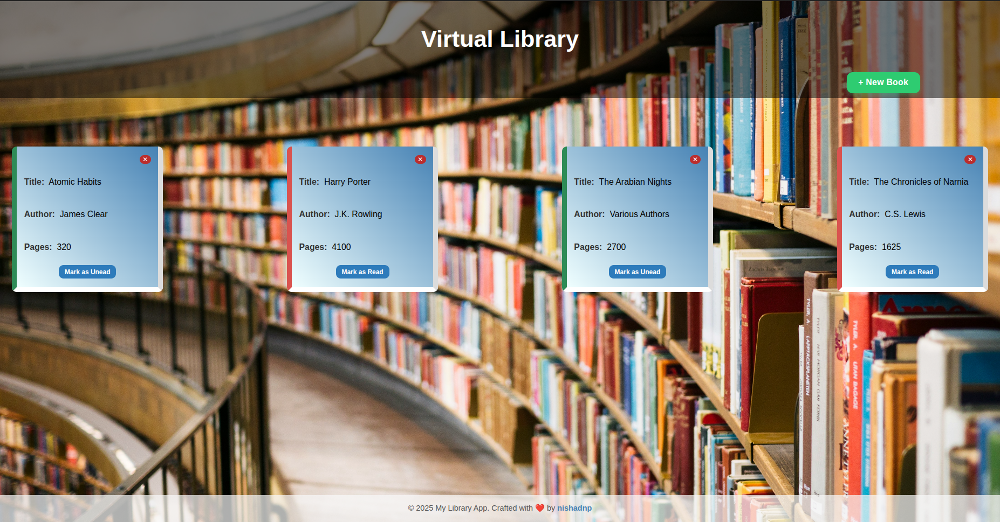

# library-app 


## About 

A simple **Library App** built with **vanilla JavaScript**, **HTML**, and **CSS**.  This project allows users to **add**, **remove**, and **update** books in a personal library collection.

## Screenshot 


*Desktop view of the library-app project*

## Features

- 📚 Add new books through a form dialog  
- 🗑️ Remove books from the library  
- ✅ Toggle each book’s **read/unread** status  
- 🧱 Automatically generates unique IDs for every book  
- 🎨 Simple and responsive card-based layout  
- 🧠 Built using **constructors** and **prototypes** for OOP demonstration

## Quick Guide

- **Click “New Book”** → Opens a form dialog  
- **Enter details** → Title, Author, Total Pages, and Read Status  
- **Submit** → Instantly adds the new book to your library  
- **Toggle read status** → Click the *Read/Unread* indicator  
- **Remove book** → Click the ✕ button on the book card  

> 💡 All interactions are instant — no reloads required.

## Project Structure 

```
library-app/
    ├── assets/
    │   ├── images/
    │   │   └── library-bg_image.jpg
    │   └── screenshots/
    │       └── library-app_screenshot.png
    ├── css/
    │   └── style.css
    ├── index.html
    ├── js/
    │   └── script.js
    └── README.md
```

## Link 

Live Demo ---> [library-app](https://nishadnp.github.io/library-app/)

## Future Improvements

- 💾 Add **LocalStorage** support to persist data  
- 🔍 Implement **search** and **filter** features  
- 🖼️ Option to upload or assign book cover images  
- 📱 Enhance mobile responsiveness further  

## Credits

Background image by [Susan Q Yin](https://unsplash.com/@syinq) on [Unsplash](https://unsplash.com)  
*(Free to use under the [Unsplash License](https://unsplash.com/license))*